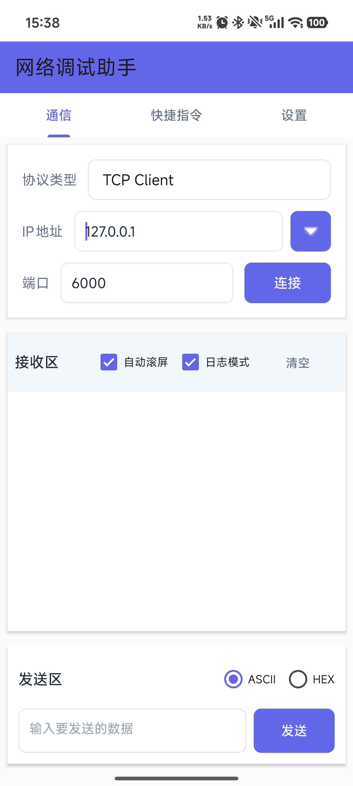
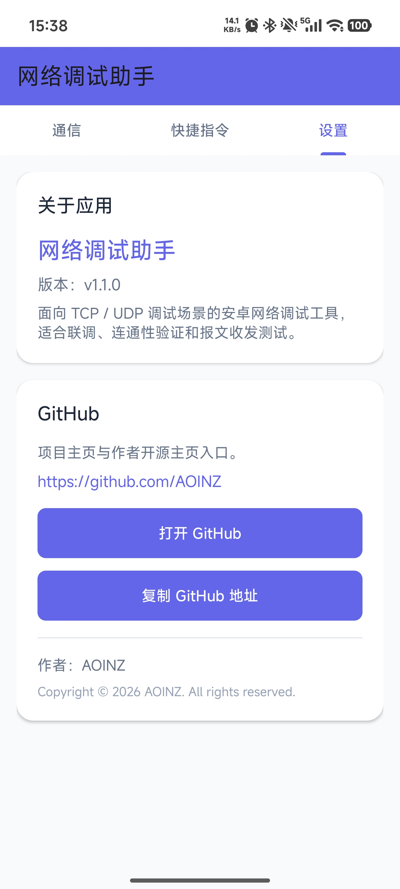

# 网络调试助手

一款面向 Android 手机端的网络调试工具，适用于 TCP / UDP 联调、设备通信验证、接口测试和局域网排障。

## 项目亮点

- 支持 `TCP Client`、`TCP Server`、`UDP`
- 支持实时收发日志显示
- 支持手机端快速联调，适合现场测试
- 已提供可安装 APK，开箱可用

## 适用场景

- 调试局域网内设备通信
- 验证服务端端口是否可连通
- 测试 TCP / UDP 数据收发
- 演示或交付手机端网络调试工具

## 界面预览

### 主界面



### 设置页



## 功能说明

### 1. 网络模式

- TCP Client
- TCP Server
- UDP

### 2. 调试能力

- 自定义目标 IP 和端口
- 发送与接收日志展示
- 适合基础联调与连通性排查

### 3. 辅助功能

- 应用基础设置
- GitHub 入口展示

## 快速开始

### 方式一：直接安装 APK

项目已构建安装包，可直接安装：

- Debug 包：`app/build/outputs/apk/debug/app-debug.apk`
- Release 包：`app/build/outputs/apk/release/app-release.apk`

### 方式二：本地构建

1. 使用 Android Studio 打开项目。
2. 等待 Gradle 同步完成。
3. 运行项目或构建 APK。

## 开发环境

- Android SDK 33
- Java 8+
- Gradle

## 项目结构

```text
android_TCP/
├─ app/
│  ├─ src/main/java/com/example/netassist/
│  └─ src/main/res/
├─ gradle/
├─ README.md
└─ 交付说明文档.md
```

## 仓库说明

为避免敏感信息泄露，以下内容不会上传到 GitHub：

- 本地签名文件 `.jks`
- `keystore.properties`
- 本地 IDE 配置
- 构建缓存与输出目录
- 敏感资料与内部业务信息

## 作者

- GitHub: [AOINZ](https://github.com/AOINZ)
